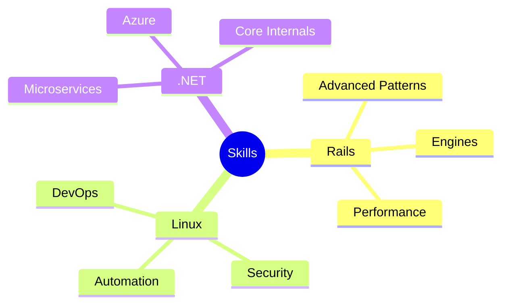

<h1 align="center">
  
</h1>

<div align="center">
  
[](https://github.com/i-ishaque)
[](https://github.com/i-ishaque)

</div>

## 🎯 Professional Focus

```ruby
class Developer < SoftwareArtisan
  def initialize
    @languages = ['Ruby', 'C#', 'JavaScript', 'Bash']
    @frameworks = ['Ruby on Rails', '.NET', 'React']
    @status = 'Crafting elegant solutions'
    @current_location = 'Terminal'
  end

  def daily_routine
    wake_up
    drink_coffee while coffee.empty?
    code until tests.pass?
    sleep unless debugging?
  end
end
```

## 🛠️ Tech Arsenal

<table>
  <tr>
    <td align="center" width="96">
      
      <br>Ruby
    </td>
    <td align="center" width="96">
      
      <br>Rails
    </td>
    <td align="center" width="96">
      
      <br>Linux
    </td>
    <td align="center" width="96">
      
      <br>.NET
    </td>
  </tr>
</table>

## 🌟 Expertise Zones

### 🚂 Ruby on Rails Territory
- RESTful API Architecture
- Test-Driven Development (RSpec)
- ActiveRecord Mastery
- Background Jobs (Sidekiq)
- Rails Engine Development

### 🐧 Linux Domain
- Shell Scripting Virtuoso
- System Administration
- Docker Containerization
- Performance Optimization
- Server Hardening

### 🎯 .NET Universe
- ASP.NET Core Web APIs
- Entity Framework Core
- LINQ Operations
- Dependency Injection
- Microservices Architecture

## 📈 GitHub Analytics

<div align="center">
  
[](https://git.io/streak-stats)


|  |  |
| ------------- | ------------- |

</div>

## 🎨 Featured Projects

<div align="center">

[](https://github.com/yourusername/your-rails-project)
[](https://github.com/yourusername/your-dotnet-project)

</div>

## 🎓 Current Learning Path



## 💡 Philosophy Corner

> "Code is like humor. When you have to explain it, it's bad." - Cory House

I believe in:
- Writing self-documenting code
- Following SOLID principles
- Contributing to open source
- Sharing knowledge
- Continuous improvement

## 🤝 Let's Connect!

<div align="center">

[](your-linkedin-url)
[](your-twitter-url)
[](your-dev.to-url)

</div>

## ⚡ Fun Facts

- I debug with `puts` and `console.log` 🐛
- My best code is written after midnight ⌚
- I can exit Vim... most of the time 😅
- Tabs > Spaces (fight me!) 💪

---

<div align="center">

### 📊 This Week's Coding Time

<!--START_SECTION:waka-->
```text
Ruby         12 hrs 30 mins  ███████████░░░░░░░  60.25%
C#           5 hrs 45 mins   ██████░░░░░░░░░░░░  27.75%
Shell        2 hrs 30 mins   ███░░░░░░░░░░░░░░░  12.00%
```
<!--END_SECTION:waka-->


<!-- Yes, this README was created with Markdown 😎 -->

</div>
